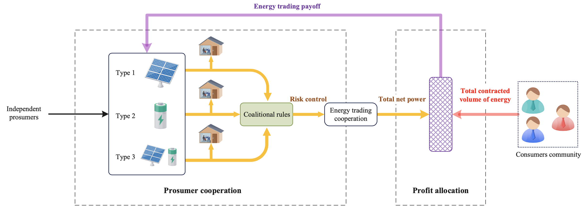

This project aims to provide a comprehensive set of simulation datasets and core algorithms for implementing and testing the performance of a P2P energy trading framework.

## Framework
The envisaged peer-to-peer energy trading framework is crafted in the following manner:



## Description                    
```                    
/data set
    ├─ c1_beta_parameter_fit.m        # parameter fitting of beta distribution and Q-Q plot
    ├─ c2_energy_load.m               # aggregate the energy load data of prosumers
    ├─ Beta_parameter_data.mat        # parameter fitting results of beta distribution for different time
    ├─ Energy_load_data.mat           # energy load data aggregation results
    ├─ gqqplot.m.                     # QQ plot function
    ├─ solar radiation data.zip       # records of solar radiation intensity data
    ├─ prosumer energy load.zip       # records of energy load for 100 prosumers
/coalitional rules
    ├─ c1_no_coalitional_rules.m      # payoff of prosumers group when not applying coalitional rules
    ├─ c2_with_coalitional_rules.m    # payoff of prosumers group when applying coalitional rules
    ├─ Beta_parameter_data.mat        # parameter fitting results of beta distribution for different time
    ├─ Energy_load_data.mat           # energy load data aggregation results
/payoff distribution
    ├─ Payoff_distribution.m          # Shapely value-based payoff distribution scheme
    ├─ plot_payoff.m                  # a plot function
    ├─ Beta_parameter_data.mat        # parameter fitting results of beta distribution for different time 
    ├─ Energy_load_data.mat           # energy load data aggregation results.
```

## Dependencies
* MATLAB 2020a or later
* Windows 10 or later

## Use
Before executing MATLAB codes, make sure to extract the files 'solar radiation data.zip' and 'prosumer energy load.zip' to their respective directories.

## Authors
* Da-Wen Huang, College of Computer Science, Sichuan Normal University, China, hdawen@sicnu.edu.cn.
* Fengji Luo, School of Civil Engineering, University of Sydney, Sydney, fengji.luo@sydney.edu.au.
* Jichao Bi, State Key Laboratory of Industrial Control Technology, Department of Control Science and Engineering, Zhejiang University, China, jonny.bijichao@zju.edu.cn.

## Version History
* 0.1
    * Initial release
